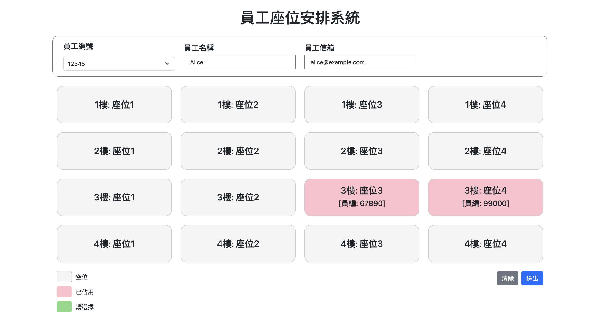

## 作品介紹

> 這個作品是一個基於Spring Boot和Vue.js建構。前端使用Vue 3框架；後端使用Spring Boot提供API服務，並使用MS SQL資料庫存取資料。
> 

---

## 畫面

> 主畫面
> 

---



> 員工編號下拉式選單， 選擇後會顯示此『員工編號』的『員工名稱』,『員工信箱』
> 


> 點選空的座位後，會顯示綠色已選取，按下送出之後，會在提醒選擇的座位資訊
> 


> 成功訂位，座位會顯示紅色並會標上會員編號
> 


> 選擇『清除』，會取消當前座位的訂位
> 


> alert會告訴你取消的座位資訊
> 


> 如果座位被11223員工預定了（左圖），55667員工在頁面沒有刷新的情況下（右圖），訂了1樓座位1，按下『送出』之後，再次確認座位按『確認』，會彈出alert告訴使用者，這個位置已經被預訂了
> 


---

## 專案主要架構

該專案的目錄結構如下所示：

```
BoChen_eSun_Assignment/
├── back
├── DB
└── front
```
## 說明

### front

本專案使用Vite作為前端建構工具，並基於Vue.js框架進行開發。

### back

Spring Boot 專案

### DB

- **Create.sql**: 用於創建資料庫結構。
- **Insert.sql**: 用於寫入初始化數據。

---

## 使用技術

### 前端

- **Vue**: v3.4.21
- **Axios**
- **Bootstrap**
- ...

### 後端

- **JDK**: 17
- **Spring Boot**: v3.2.3
- **Maven**

### 資料庫

- **MS SQL**


---

## 環境設定

### 前端

1. 確保已安裝 Node.js 和 npm。
2. 進入 `frontend` 目錄，安裝依賴：
    
    ```bash
    cd frontend
    npm install
    ```
    
3. 啟動開發伺服器：
    
    ```bash
    npm run dev
    ```
    
4. 前端開發伺服器將在預設的 http://localhost:5173 執行。

### 後端

1. 進入 `backend` 目錄，運行 Spring Boot 應用：
2. 後端伺服器會在 [http://localhost:8080](http://localhost:8080/) 執行。

<aside>
💡 請確保在 Spring Boot 的 application.properties 文件中，將資料庫的連接設定更改為您本機環境的資料庫帳號和密碼。以下是範例：

</aside>

```
spring.datasource.username=使用者帳號（sa）
spring.datasource.password=使用者密碼（P@ssw0rd）
```

---

## 資料庫

1. 確保已安裝 MS SQL。
2. 資料庫相關設定：
    - **資料庫名**：esunAssignment
    - **埠號**: 1433
    - **用戶名**: sa
    - **密碼**: P@ssw0rd

### 資料庫設計

- Employee
    
    
    |  | 欄位名稱 | 說明 | 類型 |
    | --- | --- | --- | --- |
    | Primary Key | EMP_ID | 員編 | CHAR(5) |
    |  | NAME | 員工姓名 | NVARCHAR(25) |
    |  | EMAIL | 員工電子郵件 | NVARCHAR(30) |
    | Foreign key / Uniqlo Key(非Null) | FLOOR_SEAT_SEQ  | 座位資訊 | INT |
- SeatingChart
    
    
    |  | 欄位名稱 | 說明 | 類型 |
    | --- | --- | --- | --- |
    | Primary Key | FLOOR_SEAT_SEQ | 序號 | INT |
    |  | FLOOR_NO | 樓層編號 | INT |
    |  | SEAT_NO | 座位編號 | INT |